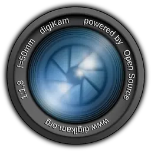

#  DigiKam - Professional Photo Management with the Power of Open Source

| CI Job        | Status                                                                                                                                                                                                  |
|---------------|---------------------------------------------------------------------------------------------------------------------------------------------------------------------------------------------------------|
| Gitlab Builds |                                                       |
| Coverity Scan |                                                                                  |

If you are reading this on Github, be aware that this is just a mirror. Our real code repository [is located here](https://invent.kde.org/graphics/Digikam)

Developers, if you want to contribute, see the online [API documentation here](https://www.Digikam.org/api)

NOTE: this project support Qt5 and Qt6 frameworks.

# About

Digikam is an advanced open-source digital photo management application that runs on Linux, Windows, and MacOS.
The application provides a comprehensive set of tools for importing, managing, editing, and sharing photos and RAW files.

You can use Digikam's import capabilities to easily transfer photos, RAW files, and videos directly from your camera
and external storage devices (SD cards, USB disks, etc.). The application allows you to configure import settings
and rules that process and organize imported items on-the-fly.

Digikam organizes photos, RAW files, and videos into albums. But the application also features powerful tagging
tools that allow you to assign tags, ratings, and labels to photos and raw files. You can then use filtering
functionality to quickly find items that match specific criteria.

In addition to filtering functionality, Digikam features powerful searching capabilities that let you search
the photo library by a wide range of criteria. You can search photos by tags, labels, rating, data, location,
and even specific EXIF, IPTC, or XMP metadata.

You can also combine several criteria for more advanced searches. Digikam rely on Exiv2 library to handle metadata
tag contents from files to populate the photo library.

Digikam can handle RAW files, and the application uses the excellent LibRaw library for decoding raw files.
The library is actively maintained and regularly updated to include support for the latest camera models.

The application provides a comprehensive set of editing tools. This includes basic tools for adjusting colors,
cropping, and sharpening as well as advanced tools for, curves adjustment, panorama stitching, and much more.
A special tool based on Lensfun library permit to apply lens corrections automatically on images.

Extended functionality in Digikam is implemented via a set of tools, dedicated especially to import and export
contents to remote web-services.

Digikam is based in part on the work of the Independent JPEG Group.

# Authors

See [AUTHORS](AUTHORS) file for details.

# Related URLs

* [Digikam project web site](https://www.Digikam.org)
* [Digikam handbook git repository](https://invent.kde.org/documentation/Digikam-doc)
* [Digikam web site git repository](https://invent.kde.org/websites/Digikam-org)
* [Digikam unit-test data git repository](https://invent.kde.org/graphics/Digikam-test-data)

# Contact

If you have questions, comments, and suggestions, write an email to:

Digikam-users@kde.org

IRC channel from irc.libera.chat server: #Digikam (or use [web chat](https://web.libera.chat/))

Also you can ask to the forum:
https://discuss.kde.org/tag/digikam

# Bug reports

IMPORTANT: the bug reports and wishlist entries are hosted by the Bugzilla
system which can be reached from the standard Help menu of Digikam.
A mail will automatically be sent to the Digikam development mailing list.
There is no need to contact directly the Digikam mailing list for a bug report
or a devel wish.

The current bugs and devel wishes reported to the bugzilla servers can be seen at this url:

* [Digikam](https://bugs.kde.org/buglist.cgi?product=Digikam&bug_status=UNCONFIRMED&bug_status=NEW&bug_status=ASSIGNED&bug_status=REOPENED)

Extra Bugzilla servers for shared libs used by Digikam :

* [LibRaw library](https://github.com/LibRaw/LibRaw/issues)
* [Lensfun library](https://github.com/lensfun/lensfun/issues)
* [GPhoto2 library](http://gphoto.org/bugs)
* [Exiv2 library](https://github.com/Exiv2/exiv2/issues)

# Compilation and Installation

From the **developper documentation** [available at this url](https://files.kde.org/Digikam/api/), see the sections:

- **External Dependencies**
- **Get Source Code**
- **Development Environment**
- **Cmake Configuration Options**
- **Setup Local Compilation and Run-Time**

# Donate Money

If you love Digikam, you can help developers to buy new photo devices to test
and implement new features. Thanks in advance for your generous donations.

For more information, look [at this url](https://www.Digikam.org/donate/)
